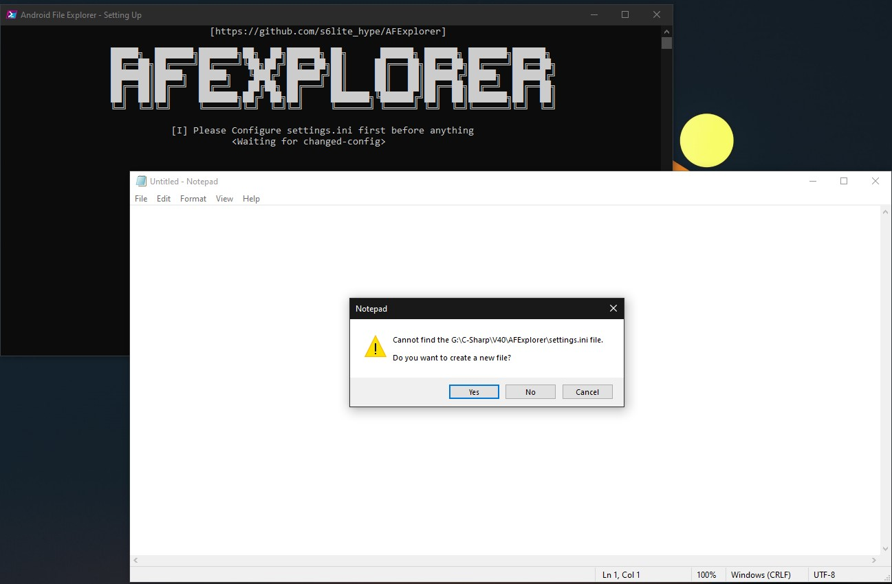
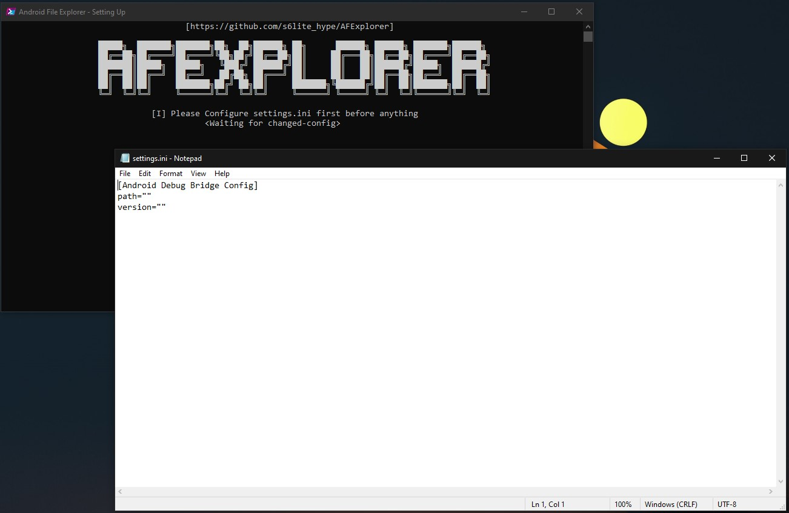
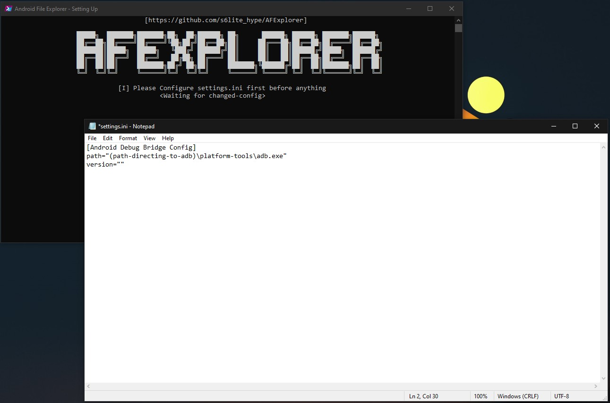

                                  https://github.com/6lite_hype/AFExplorer

# AFExplorer - Preview (Not released yet!)
> [!WARNING]
> Please be advised that I shall not be held liable for any form of data loss or damage incurred through the use of this program. Users assume all risks associated with the installation and utilization of the software. It is strongly recommended that users implement comprehensive data backup measures and exercise caution when deploying this program in any environment. By proceeding with the use of this program, users acknowledge and accept full responsibility for any potential adverse effects, including but not limited to data corruption, hardware malfunctions, or system failures. The developer disclaims any liability for incidental, consequential, or special damages of any nature arising from the use or performance of the program.

## This program is intended to run on Windows 10 22H2 and up.
This program is designed to function optimally with Windows 10 and earlier versions. However, it is advisable to verify the program's performance on your specific system configuration to ensure compatibility and smooth operation. Given the widespread use of Windows 10, this precaution is intended to address any potential issues and provide the best user experience possible.


> [!IMPORTANT]
> This program requires .NET 9.0.x to operate correctly. Please install the  [.NET SDK 9.0 here](https://dotnet.microsoft.com/en-us/download/dotnet/9.0) to ensure the program runs as intended. Note that this program does not utilize a single-file executable format, so the proper .NET environment must be set up on your system.

## What does this program even used for?
This program is designed to assist you in navigating your Android operating system using ADB (Android Debug Bridge). It enables you to move, copy, or delete files and folders from your Android device's storage. However, it is crucial to exercise caution when deleting files. Ensure that you thoroughly verify the importance of a file before deletion, as mistakenly removing essential files can lead to unintended consequences.

## I have downloaded the program, what should I do?
First, ensure that USB Debugging is enabled on your Android device.

To enable USB Debugging on your Android device, you typically follow these steps:

1. Open Settings: Open the Settings app on your Android device.
2. Navigate to Developer Options: Scroll down and find the "Developer options" menu. If you don't see it, go to "About phone" or "About device" and tap on the "Build number" multiple times (usually seven times) until you see a message saying "You are now a developer!" This unlocks the Developer options menu.
3. Enable Developer Options: Go back to the main Settings screen and open the "Developer options" menu.
4. Turn on USB Debugging: Within the Developer options, find and toggle the switch for "USB Debugging" to enable it. You may be prompted to confirm your action.
5. Connect your Device: Connect your Android device to your computer using a USB cable.
6. Allow USB Debugging: When you connect your device to the computer for the first time, you may see a prompt on your device asking if you want to allow USB debugging from this computer. Check the box for "Always allow" and tap "OK" to confirm.

Once USB Debugging is enabled, your Android device is ready to communicate with your computer via ADB. You can now proceed to start the program.

When the program is started for the first time, it should display something similar to this:


After you open the program, Notepad should also launch. If a MessageBox appears with the prompt "Create New File," click "Yes," as the file did not exist initially. The prompt will look like this:



You may need to:
1. Paste this code in the ini file
```ini
[Android Debug Bridge Config]
path="C:\path\to\adb.exe"
version="2.1.3"
```
2. Re-open the program to allow it to insert the necessary code. Upon re-opening, the program should add the code similar to the following:



However, there are instances where this method may not be as effective. In such cases, I prefer the first option.

## What should I add now?
The next step is to specify the path to the Android Debug Bridge (ADB). This path can be located anywhere on your PC. To add it, use the full path directing to the adb.exe file, such as this example:



Now, save the file. The program will then proceed to use the specified ADB path.

## I got an error code of ECODE1
This essentially indicates that an issue has occurred while using the application. Common problems include:

The Android Debug Bridge (ADB) is unable to detect any connected devices.
The application is unable to remove or move files because they are set to read-only.
Ensure that your device is properly connected and that you have the necessary permissions to modify files.

  
Ensure that your device is properly connected and recognized by the system. Additionally, verify that the files or folders you wish to delete have the appropriate read-write permissions and are not set to read-only.
