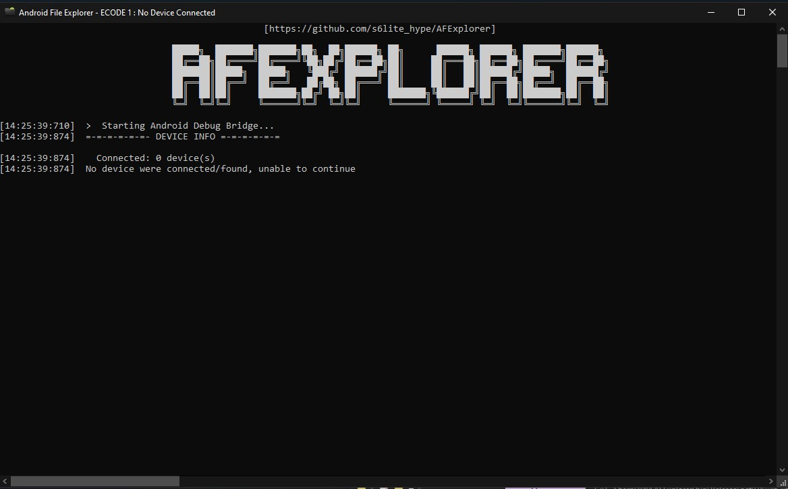
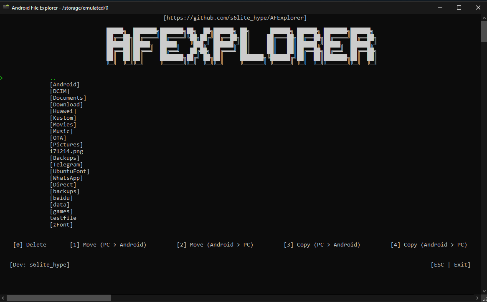

                                      https://github.com/6lite-hype/AFExplorer

# AFExplorer - Preview
> [!WARNING]
> Please be advised that I shall not be held liable for any form of data loss or damage incurred through the use of this program. Users assume all risks associated with the installation and utilization of the software. It is strongly recommended that users implement comprehensive data backup measures and exercise caution when deploying this program in any environment. By proceeding with the use of this program, users acknowledge and accept full responsibility for any potential adverse effects, including but not limited to data corruption, hardware malfunctions, or system failures. The developer disclaims any liability for incidental, consequential, or special damages of any nature arising from the use or performance of the program.

## What does this program even used for?
This program is designed to assist you in navigating your Android operating system using ADB (Android Debug Bridge). It enables you to move, copy, or delete files and folders from your Android device's storage. However, it is crucial to exercise caution when deleting files. Ensure that you thoroughly verify the importance of a file before deletion, as mistakenly removing essential files can lead to unintended consequences.

## I have downloaded the program, what should I do?
First, ensure that USB Debugging is enabled on your Android device.

To enable USB Debugging on your Android device, you typically follow these steps:

1. Open Settings: Open the Settings app on your Android device.
2. Navigate to Developer Options: Scroll down and find the "Developer options" menu. If you don't see it, go to "About phone" or "About device" and tap on the "Build number" multiple times (usually seven times) until you see a message saying "You are now a developer!" This unlocks the Developer options menu.
3. Enable Developer Options: Go back to the main Settings screen and open the "Developer options" menu.
4. Turn on USB Debugging: Within the Developer options, find and toggle the switch for "USB Debugging" to enable it. You may be prompted to confirm your action.
5. Connect your Device: Connect your Android device to your computer using a USB cable.
6. Allow USB Debugging: When you connect your device to the computer for the first time, you may see a prompt on your device asking if you want to allow USB debugging from this computer. Check the box for "Always allow" and tap "OK" to confirm.

Once USB Debugging is enabled, your Android device is ready to communicate with your computer via ADB. You can now proceed to start the program.

> [!TIP]
> Prior to commencing the program, please ensure that the platform-tools folder is located within the same directory as the program. Additionally, as a precautionary measure, upon downloading the program, the platform-tools directory should also have been included.

When the program initializes and does not detects the absence of connected devices, it will display the following:

This is acceptable. Please ensure that your device is connected and detected. Once this is confirmed, the program should display a similar message:

And you're good to go!

> [!NOTE]
> This project is open-sourced and provided to you under the MIT License. You are granted the freedom to edit, modify, and change any files as needed. However, it is important to note that I will not be liable for any damages incurred. Therefore, proceed at your own risk.
> 
> This program supports the following Operating System :
> 1. Windows (x32)
> 2. Windows (x64)
> 3. Linux (x86)
> 4. Linux (x64)
> 5. OSX [Mac] (x64)
>
> This program may contain bugs that are not apparent to me as the developer but may be evident to you. To report any issues, please navigate to GitHub, select "Issues," and then click on "New Issue."
